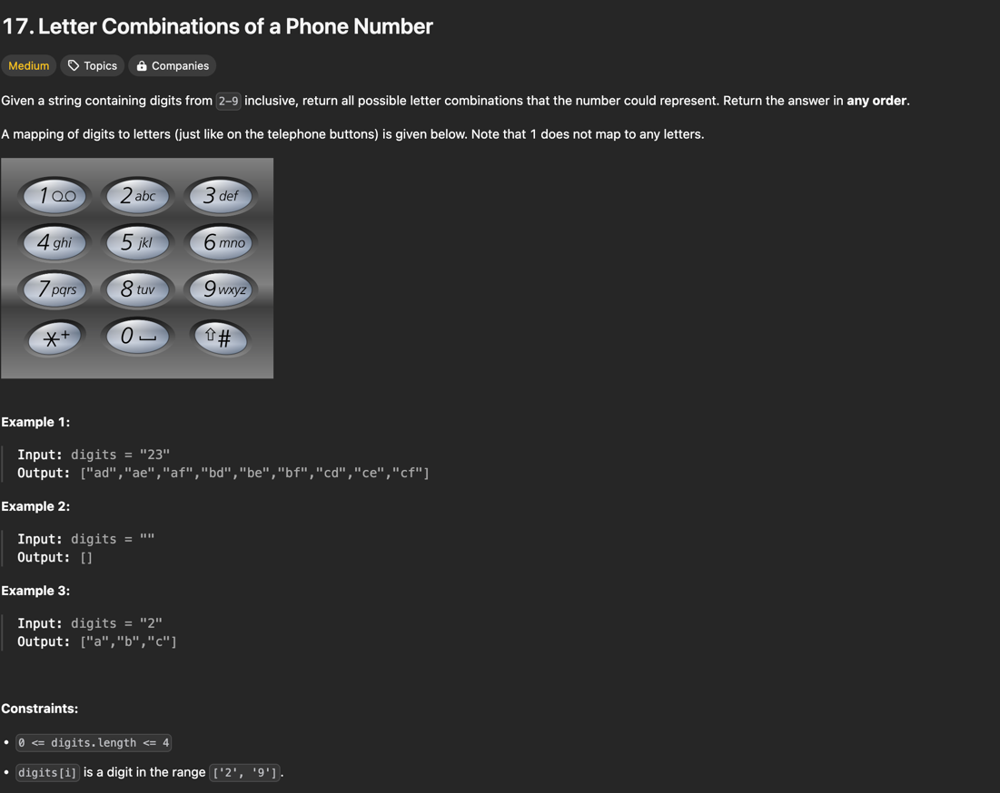

# Задача 1 LeetCode

Условие задачи представлено ниже



## Решение

```python
class Solution:
    keyboard = {
        "2": "abc", "3": "def", "4": "ghi", "5": "jkl",
        "6": "mno", "7": "pqrs", "8": "tuv", "9": "wxyz"
    }

    def letterCombinations(self, digits: str) -> List[str]:
        if not digits:
            return []

        res = []

        def backtrack(index, path):
            if index == len(digits):
                res.append("".join(path))
                return
                
            for char in self.keyboard[digits[index]]:
                path.append(char)
                backtrack(index + 1, path)
                path.pop()

        backtrack(0, [])
        return res
```

## Объяснение

Используется метод backtracking для генерации всех возможных комбинаций букв по цифрам.
На каждом шаге мы перебираем все буквы, соответствующие текущей цифре, добавляем букву к пути (path) и 
рекурсивно вызываем функцию для следующей цифры. Когда путь достигает длины исходной строки — добавляем результат.
Словарь keyboard задаёт соответствие цифр буквам, как на кнопочном телефоне