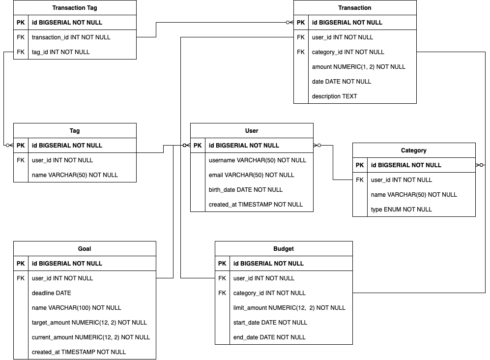

# Finance Manager API App

<div id="stack-badges">
    <a href="https://www.python.org/">
        
    </a>
    <a href="https://fastapi.tiangolo.com/">
        
    </a>
    <a href="https://alembic.sqlalchemy.org/en/latest/">
        
    </a>
    <a href="https://www.sqlalchemy.org/">
        
    </a>
</div>

---

The goal of this project is to practice writing a FastAPI backend in Python. 
You can find the OpenAPI swagger documentation [here](media/openapi.json). 
The project includes the following features:

- The API uses PostgreSQL as the database
- Migrations are handled using Alembic
- Authentication is implemented using JWT 
- A linter is set up along with a GitHub workflow for linting 
- The application configuration is managed via env variables

In order to check all available utils `Makefile` commands type: 
```shell
make
```

And see the available commands below. 
Some cmds require additional packages in order to run:
```yaml
# cmds example
help: Show help for each of the Makefile recipes.
install-local: Install all requirements locally.
freeze: Freeze all requirements.
run-local: Run the app locally.
init-migration: Create alembic migration.
create-migration: Create alembic migration files. Use MESSAGE var to set revision message.
do-migration: Apply latest migrations.
migrate: Create and apply migration in one step.
lint: Lint the whole project with black, isort and flake8 (install, if not installed).
openapi: Download the OpenAPI protocol from the running app.
```

## How to run the app? 

### Docker 

TBD

### Manual

In order to run the app:

0. Create a new python env 
1. Install requirements from [`requirements.txt`](requirements.txt)
2. Fill the [`.env`](.env.example) config for the app 
3. Run the cmd:
    ```shell
    make run-local
    ```

## DataBase API Model




